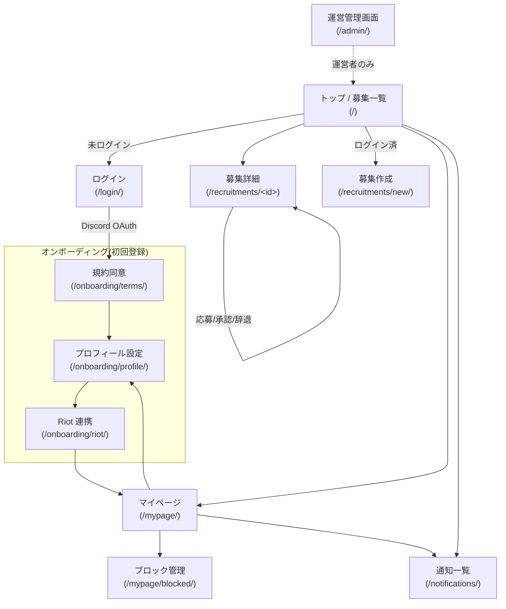
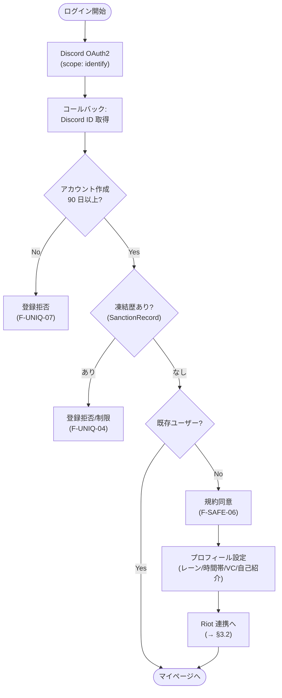
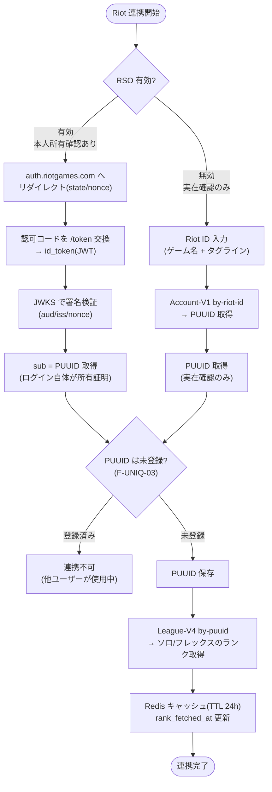
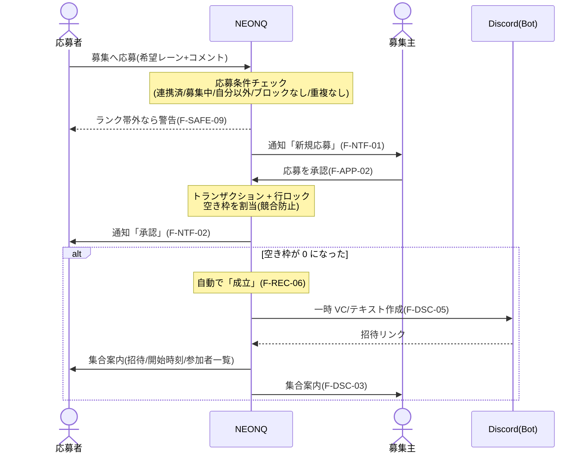
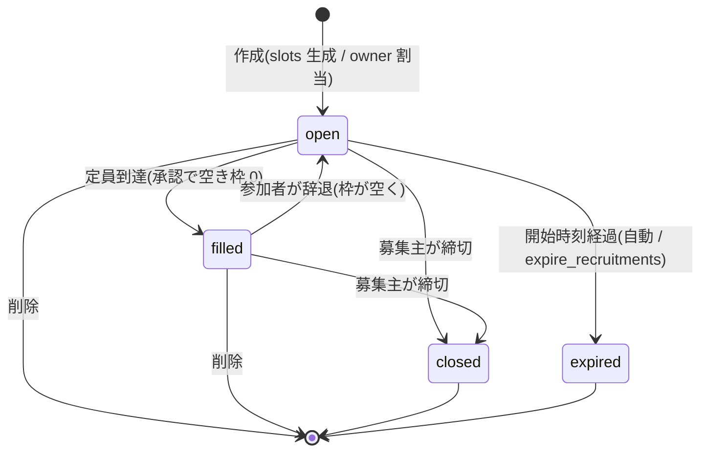
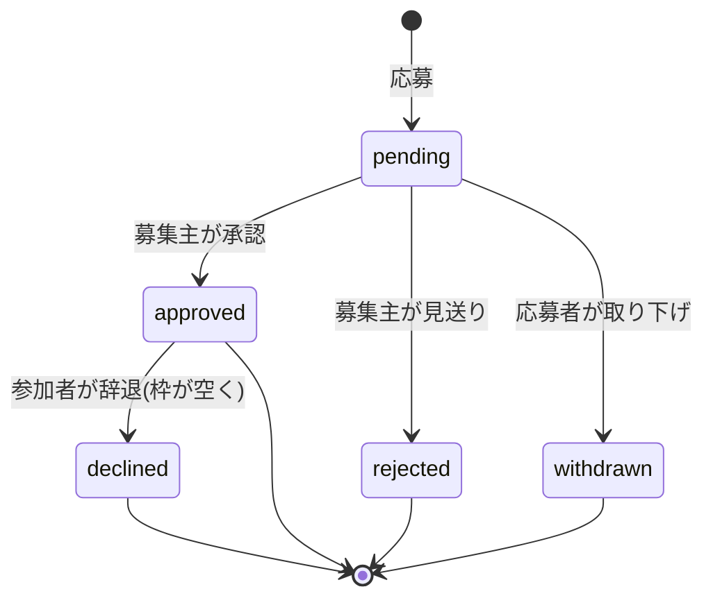
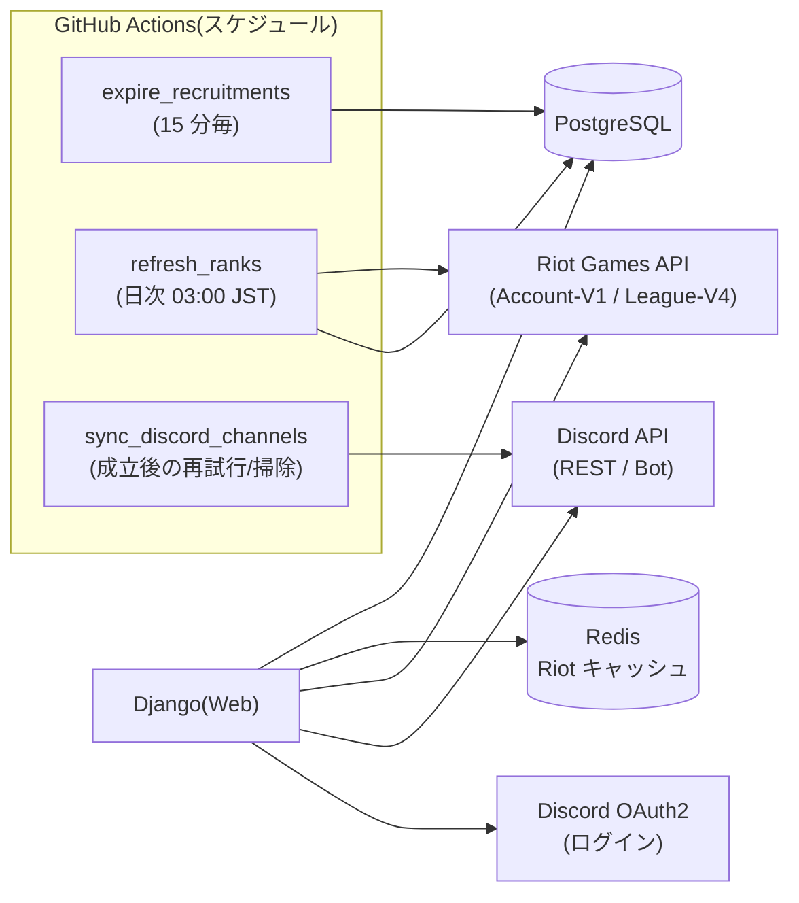

# 機能一覧 / フロー・遷移図 — NEONQ

League of Legends のメンバー募集・応募サービス **NEONQ** の機能一覧と、
主要なフロー・画面遷移・状態遷移をまとめたドキュメント。

- 対象: フェーズ 1(MVP / M1〜M7 完了済み)
- 一次資料: [REQUIREMENTS.md](../REQUIREMENTS.md)(要件定義)・[ARCHITECTURE.md](../ARCHITECTURE.md)(基本設計)
- 用語:
  - **要件 ID**(例 `F-ACC-01`)= 要件定義書の機能要件番号
  - **オンボーディング** = 新規登録後に行う初期設定(規約同意 → プロフィール → Riot 連携)の一連の流れ
  - **RSO**(Riot Sign On)= Riot アカウントでログインして本人所有を確認する公式の仕組み

> 図は **Mermaid 記法**。GitHub 上ではそのまま図として描画される。

---

## 1. 機能一覧

担当アプリは Django のアプリ単位(`accounts` / `recruitments` / `applications` /
`notifications` / `moderation` / `games`)。URL は実装ルーティングに対応する。

### 1.1 アカウント・プロフィール(`accounts`)

| 機能 | 要件 ID | 主な URL | 補足 |
|---|---|---|---|
| Discord OAuth ログイン / 新規登録 | F-ACC-01 | `/login/`, `/accounts/discord/login/` | 独自パスワードは持たない(allauth) |
| Discord 名・アバター自動取込 | F-ACC-02 | (ログイン時) | 初回登録時に取得 |
| 利用規約・ガイドライン同意 | F-SAFE-06 | `/onboarding/terms/` | 登録時に同意を取得 |
| プロフィール設定(レーン・時間帯・VC スタイル・自己紹介) | F-ACC-04/05 | `/onboarding/profile/`, `/mypage/profile/` | |
| Riot ID 実在確認・連携 | F-ACC-03, F-UNIQ-03 | `/onboarding/riot/` | PUUID を一意登録 |
| Riot Sign On(本人所有確認) | F-ACC-09 | `/onboarding/riot/rso/login/`, `/onboarding/riot/rso/callback/` | RSO 環境変数があれば有効 |
| ランク自動取得(ソロ/フレックス)・表示 | F-ACC-06 | (連携時 / マイページ) | 自己申告不可・API 値のみ |
| ランク手動更新(クールダウン付き) | F-ACC-08 | `/mypage/riot/refresh/` | 既定 10 分クールダウン |
| ランク定期更新 | F-ACC-08 | `manage.py refresh_ranks` | GitHub Actions で日次 |
| マイページ(プロフィール・自分の募集・応募中) | S-04 | `/mypage/` | |
| 退会(個人情報削除・履歴匿名化) | F-ACC-07 | (Admin / モデル) | 論理削除 + カラム null 化 |

### 1.2 アカウント一意性・サブ垢/スマーフ対策(`accounts`)

| 機能 | 要件 ID | 実装ポイント |
|---|---|---|
| 1 Discord = 1 アカウント | F-UNIQ-02 | `discord_id` unique 制約 |
| 1 Riot(PUUID)= 1 ユーザー | F-UNIQ-03 | `riot_puuid` unique 制約 |
| 作りたて Discord アカウントの登録拒否 | F-UNIQ-07 | Snowflake から作成日時を算出、既定 90 日未満は拒否 |
| 凍結逃れ(作り直し)の防止 | F-UNIQ-04 | `SanctionRecord` を discord_id 単位で保持し再登録時に引き継ぐ |
| 複数アカウント疑いの調査・凍結 | F-UNIQ-06 | Django Admin から運営が操作 |

### 1.3 募集(`recruitments`)

| 機能 | 要件 ID | 主な URL |
|---|---|---|
| 募集の作成(構造化フォーム) | F-REC-01/02/03 | `/recruitments/new/` |
| 募集詳細表示 | S-02 | `/recruitments/<id>/` |
| 募集の編集 | F-REC-04 | `/recruitments/<id>/edit/` |
| 募集の締切 | F-REC-04 | `/recruitments/<id>/close/` |
| 募集の削除 | F-REC-04 | `/recruitments/<id>/delete/` |
| 自動期限切れ(開始時刻経過) | F-REC-05 | `manage.py expire_recruitments`(15 分毎) |
| 定員到達で自動成立 | F-REC-06 | 承認処理内 |
| ステータス管理(募集中→成立/締切/期限切れ) | F-REC-07 | (状態遷移 → §3.4) |

### 1.4 検索・一覧(`recruitments`)

| 機能 | 要件 ID | 主な URL |
|---|---|---|
| 募集一覧(新着順/開始時刻順) | F-SRCH-01 | `/`, `/recruitments/` |
| フィルタ(モード/ランク帯/レーン/タグ/VC/募集中のみ) | F-SRCH-02 | `/?...`(GET パラメータ) |

### 1.5 応募・承認(`applications`)

| 機能 | 要件 ID | 主な URL |
|---|---|---|
| 募集への応募(希望レーン+コメント) | F-APP-01/05 | `/recruitments/<id>/apply/` |
| 応募の承認(枠割当・行ロック) | F-APP-02/03 | `/applications/<id>/approve/` |
| 応募の見送り | F-APP-02 | `/applications/<id>/reject/` |
| 応募の取り下げ | F-APP-04 | `/applications/<id>/withdraw/` |
| 参加の辞退 | F-APP-04 | `/applications/<id>/decline/` |
| ランク帯不一致の警告 | F-SAFE-09 | 応募時に警告表示 |

### 1.6 マッチング成立後・Discord 集合導線(`applications`)

| 機能 | 要件 ID | 補足 |
|---|---|---|
| Discord 招待リンク設定 | F-DSC-01 | 募集作成/編集時 |
| 招待リンクは承認済み参加者のみ表示 | F-DSC-02, N-06 | 一覧クエリから除外 |
| 成立時に参加者へ集合案内通知 | F-DSC-03 | 招待・開始時刻・参加者一覧 |
| 参加者一覧(Discord 名/Riot ID/レーン) | F-DSC-04 | 募集詳細の参加者枠 |
| 一時 VC/テキストチャンネル自動作成 | F-DSC-05 | Bot(REST API)。未設定時は手入力にフォールバック |

### 1.7 通知(`notifications`)

| 機能 | 要件 ID | 主な URL |
|---|---|---|
| 通知一覧・既読管理 | S-06 | `/notifications/`, `/notifications/read/` |
| 募集主へ: 新規応募 | F-NTF-01 | (応募作成時) |
| 応募者へ: 承認/見送り | F-NTF-02 | (承認/見送り時) |
| 参加者へ: 締切・削除・変更 | F-NTF-04 | (募集変更時) |

### 1.8 安全・健全性(`moderation` / Django Admin)

| 機能 | 要件 ID | 主な URL |
|---|---|---|
| 通報(理由選択+自由記述、サブ垢/スマーフ含む) | F-SAFE-01 | `/report/<target_type>/<id>/` |
| ブロック | F-SAFE-02 | `/block/<user_id>/` |
| ブロック解除 | F-SAFE-02 | `/unblock/<user_id>/` |
| ブロック管理一覧 | F-SAFE-02 | `/mypage/blocked/` |
| NG ワードフィルタ | F-SAFE-08 | 募集/応募コメント |
| 運営対応(通報確認・警告・凍結・非公開化) | F-SAFE-07 | `/admin/` |

### 1.9 マスタ・基盤(`games` ほか)

| 機能 | 要件 ID | 補足 |
|---|---|---|
| ゲームマスタ(レーン/モード/ランク帯の定義) | N-11 | LoL 固有値をコードに埋め込まない |
| 公開法的ページ(利用規約/プライバシー) | F-SAFE-06 | `/terms/`, `/privacy/` |
| Riot ドメイン検証 | N-14 | `/riot.txt` |
| ヘルスチェック | N-12 | `/healthz` |
| ローカルデモログイン(DEBUG 時のみ) | — | `/dev-login/` |

---

## 2. 画面遷移図(サイトマップ)

---

## 3. 主要フロー / 状態遷移

### 3.1 新規登録・オンボーディングフロー(F-ACC-01, F-UNIQ-02/04/07, F-SAFE-06)

### 3.2 Riot 連携・ランク取得フロー(F-ACC-03/06/08, F-UNIQ-03, N-13)

RSO 用の環境変数(`RSO_CLIENT_ID`/`RSO_CLIENT_SECRET`)の有無で経路が分岐する。

### 3.3 応募 → 承認 → 成立 → 集合(シーケンス図)(F-APP, F-DSC, F-NTF)

### 3.4 募集ライフサイクル(状態遷移)(F-REC-05/06/07)

### 3.5 応募ステータス(状態遷移)(F-APP-06)

---

## 4. 定期処理・外部連携

---

## 5. 関連ドキュメント

- [REQUIREMENTS.md](../REQUIREMENTS.md) — 要件定義(機能要件 F-xxx の一次資料)
- [ARCHITECTURE.md](../ARCHITECTURE.md) — 基本設計(処理フロー §5、ルーティング §6)
- [README.md](../README.md) — 実装状況(M1〜M7)とセットアップ
- [DEPLOYMENT.md](../DEPLOYMENT.md) — 本番デプロイ手順
</content>
</invoke>
